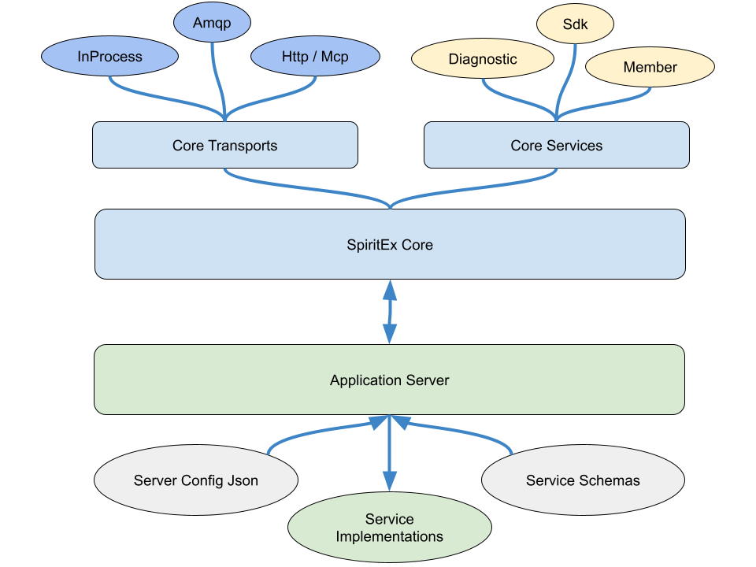

SpiritEx `Core` is a comprehensive Node.js server library that provides the
 foundational functionality needed for building distributed service-oriented
 applications.

**Core Architecture**

- Modular Service Architecture: Services are organized in folders with separate schema and implementation files.
- Multi-Transport Support: InProcess, HTTP, and AMQP transports
- Built-in Standard Services: Member (authentication), Diagnostic (server info), SDK (client generation)

**Key Features**

- User Management: Complete authentication system with JWT tokens, API keys, and session management
- Dynamic SDK Generation: Automatically generates client SDKs and documentation from service schemas
- Comprehensive Logging: Structured logging with log4js
- MCP Plugin Support: Model Context Protocol integration for AI tooling
- Peer-to-Peer Networking: Services can be distributed across multiple server instances

**Dependencies & Tech Stack**

- NodeJS: Server development platform.
- Express.js: HTTP server framework
- Sequelize: ORM with MySQL2 and SQLite3 support
- AMQP: Message queue transport via amqplib
- Security: bcrypt for password hashing, JWT for tokens
- Testing: Mocha test framework

**Service Structure**

Services follow a standardized pattern:
- ServiceSchema.js: Defines API interface using JSON Schema
- ServiceService.js: Implements business logic
- Three user types: Network, Service, User with different access levels

**Transport Layer**

- HTTP: REST API with CORS support and MCP plugin
- AMQP: Message queue-based communication
- InProcess: Direct function calls for same-process services
